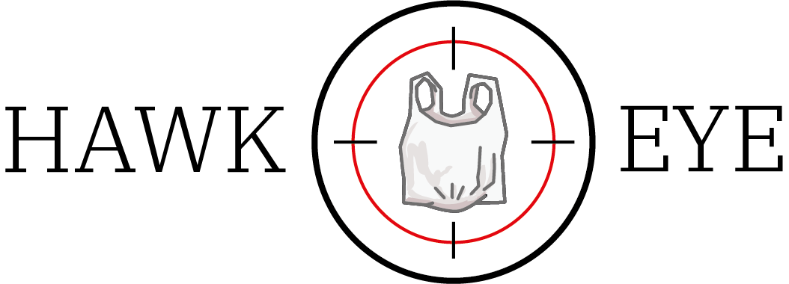

# Hawkeye




Plastic Ban Imposition.<br>
Implementing the Plastic bag ban imposed by the Govt. CCTV Camera footage will be used to detect the number of plastic bags. A notification is sent as soon as the bags are detected to the portal created for the authorities. Helps in narrowing down the area with the most number of defaulters so that necessary action can be taken. Screenshot of the footage, location, time and number of plastic bags will be present in the notification.


## Technologies Used: 

- Tensorflow object Detection API *(polybag detection)*
- Socket.io *(for real time communication)*
- Node.js *(sever side programming)*


## How to use :

Clone the repository and then : 
    
* Server Side

  Run the following commands in the terminal: 
  ```
  npm install  
  nodemon server/server.js
  ```
